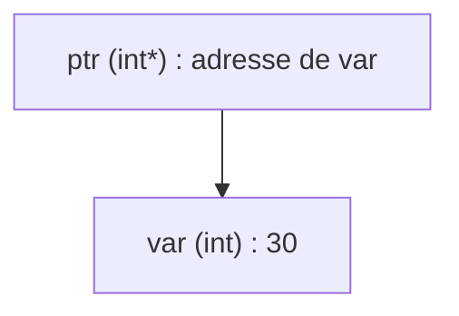

# Introduction aux pointeurs en langage C

## Définition et utilité des pointeurs

Un pointeur en C est une variable dont la spécificité est de stocker l'adresse mémoire d'une autre variable. Autrement dit, au lieu de contenir une valeur ordinaire comme un entier, un caractère ou un flottant, un pointeur contient l'emplacement où cette valeur est rangée en mémoire.

### Pourquoi utiliser des pointeurs ?

Les pointeurs permettent une gestion efficace de la mémoire et une manipulation directe des adresses mémoires, offrant ainsi plusieurs avantages clés :

- **Passage efficace de paramètres aux fonctions** : On peut passer l'adresse d'une variable à une fonction, permettant à cette dernière de modifier directement la variable originale.
- **Manipulation des tableaux et chaînes de caractères** : Les tableaux sont en fait des adresses en mémoire, et les pointeurs facilitent leur parcours.
- **Gestion dynamique de la mémoire** : Allocation et libération de mémoire à l'exécution via `malloc`, `calloc` ou `free`.
- **Création de structures de données dynamiques** : Listes chaînées, arbres, graphes, où chaque élément pointe vers un autre.
- **Interaction avec les bas niveaux matériels** : En programmation système, accéder aux adresses mémoire spécifiques, registres, etc.

## Syntaxe de base

Pour déclarer un pointeur, on utilise la syntaxe suivante :

```c
type *nom_du_pointeur;
```

où `type` est le type de donnée que pointe le pointeur. Par exemple, pour un pointeur vers un entier :

```c
int *ptr;
```

Pour affecter l'adresse d'une variable à un pointeur, on utilise l'opérateur d'adresse `&` :

```c
int var = 10;
int *ptr = &var;
```

Le pointeur `ptr` contient maintenant l'adresse mémoire de la variable `var`.

## Accès à la valeur pointée : l'opérateur de déréférencement `*`

Pour accéder ou modifier la valeur stockée à l'adresse pointée, on utilise l'opérateur `*` appelé opérateur de déréférencement :

```c
printf("Valeur de var = %d\n", *ptr);  // Affiche 10
*ptr = 20;                             // Modifie la valeur de var à 20
printf("Nouvelle valeur de var = %d\n", var); // Affiche 20
```

## Exemple complet

```c
#include <stdio.h>

int main() {
    int var = 30;
    int *ptr = &var;  // ptr pointe vers var

    printf("Adresse de var : %p\n", &var);
    printf("Adresse stockée dans ptr : %p\n", ptr);
    printf("Valeur de var via ptr : %d\n", *ptr);

    *ptr = 50; // modifie var via ptr
    printf("Nouvelle valeur de var : %d\n", var);

    return 0;
}
```

### Diagramme Mermaid illustrant la relation variable-pointeur



Ce diagramme montre que `ptr` contient l'adresse mémoire où est stockée la variable `var`.

## Sources

- [GeeksforGeeks - Pointers in C](https://www.geeksforgeeks.org/c/c-pointers/)
- [TutorialsPoint - C Pointers](https://www.tutorialspoint.com/cprogramming/c_pointers.htm)
- [FreeCodeCamp - Pointers in C Explained](https://www.freecodecamp.org/news/pointers-in-c-are-not-as-difficult-as-you-think/)
- [Stack Overflow - Why Use Pointers in C?](https://stackoverflow.com/questions/29423757/why-use-pointers-in-c)
- [Bro Code - C pointers explained (YouTube)](https://www.youtube.com/watch?v=DplxIq0mc_Y)

---

Cet article synthétise ce qu'est un pointeur en C, pourquoi il est fondamental, comment le déclarer, l'initialiser, et l'utiliser via un exemple simple avec un diagramme de leur relation mémoire. Maitriser ces bases est indispensable pour comprendre la gestion mémoire, la manipulation des données et écrire des programmes C robustes et efficaces.