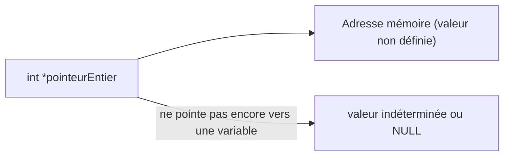

# Introduction aux pointeurs en langage C

## Syntaxe de base des pointeurs

### Déclaration d'un pointeur : `type *nomPointeur ;`

La déclaration d’un pointeur en langage C suit une syntaxe simple mais fondamentale :

```c
type *nomPointeur;
```

- **type** : correspond au type de données vers lequel le pointeur va pointer (int, float, char, struct, etc.).
- **\*** : indique que la variable déclarée est un pointeur.
- **nomPointeur** : le nom donné à la variable pointeur.

Cette déclaration crée une variable qui pourra stocker une adresse mémoire pointant vers une donnée du type spécifié.

---

### Exemple 1 : Déclaration d’un pointeur vers un entier

```c
int *pointeurEntier;
```

Ici, `pointeurEntier` est une variable capable de contenir l’adresse mémoire d’un entier.

### Exemple 2 : Déclaration d’un pointeur vers un caractère

```c
char *pointeurChar;
```

Cette déclaration crée un pointeur vers un caractère.

---

### Illustration visuelle à l’aide d’un diagramme Mermaid

Lorsque l’on déclare un pointeur, initialement il ne pointe pas vers une adresse valide (sauf si explicitement initialisé). Voici un schéma simplifié :



---

### Initialisation et assignation d’un pointeur

Après la déclaration, pour utiliser un pointeur, on doit généralement l’initialiser avec l’adresse d’une variable, grâce à l’opérateur d’adresse `&`.

```c
int var = 42;
int *pointeurEntier = &var; // Initialisation avec l'adresse de var
```

Maintenant, `pointeurEntier` contient l'adresse mémoire où `var` est stockée.

---

### Pourquoi la syntaxe place-t-elle l’astérisque à côté du nom?

Le `*` indique que la variable est un pointeur à ce type. Par exemple :

```c
int* p1, p2;
```

Ici, `p1` est un pointeur vers int, mais `p2` est une simple variable entière. Pour éviter toute confusion, il est souvent recommandé d’écrire :

```c
int *p1, *p2;
```

pour bien déclarer plusieurs pointeurs.

---

### Exemple complet : déclaration, initialisation, utilisation

```c
#include <stdio.h>

int main() {
    int nombre = 10;
    int *pointeur = &nombre;

    printf("Adresse stockée dans pointeur : %p\n", pointeur);
    printf("Valeur pointée par pointeur : %d\n", *pointeur);

    return 0;
}
```

---

### Points clés à retenir

- Un pointeur est déclaré avec `type *nom`.
- Le type du pointeur définit le type de données auquel il pourra accéder.
- Un pointeur ne contient pas la donnée elle-même, mais l’adresse d’une donnée.
- Initialiser un pointeur avant de l’utiliser est une bonne pratique pour éviter des comportements indéfinis.

---

## Sources

- [GeeksforGeeks - Pointer Declaration in C](https://www.geeksforgeeks.org/pointers-in-c-and-cpp/)
- [TutorialsPoint - C Pointers](https://www.tutorialspoint.com/cprogramming/c_pointers.htm)
- [Programiz - Pointers in C](https://www.programiz.com/c-programming/c-pointers)
- [Microsoft Docs - Pointers](https://learn.microsoft.com/en-us/cpp/c-language/pointers)
- [Stack Overflow - Clarification on pointer declarations](https://stackoverflow.com/questions/2638600/how-can-i-declare-multiple-pointers-in-c)

---

Cet article précise la syntaxe exacte pour déclarer un pointeur en C, mettant en lumière les subtilités liées à la syntaxe et l’importance de la déclaration claire et correcte des pointeurs pour une manipulation mémoire sûre.