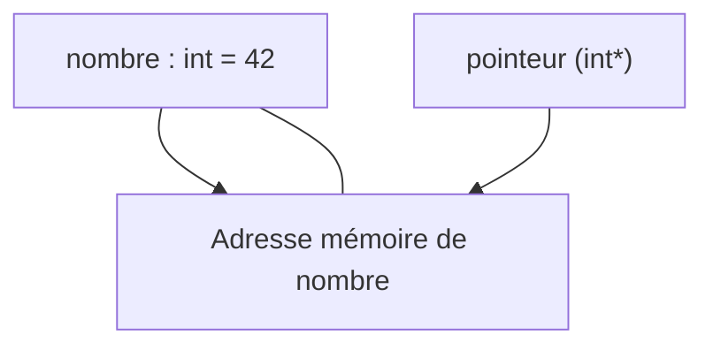

# Introduction aux pointeurs en langage C

## Syntaxe de base des pointeurs

### Initialisation avec l'adresse d'une variable : `nomPointeur = &nomVariable ;`

Une fois un pointeur déclaré, il doit être initialisé pour être utilisable. L'initialisation la plus courante consiste à affecter au pointeur l'adresse mémoire d'une variable. Cette affectation se fait à l'aide de l'opérateur « `&` », appelé opérateur d'adresse.

---

## Principe de l'initialisation

- `nomVariable` est une variable existante en mémoire, de type compatible avec le pointeur.
- `&nomVariable` récupère l'adresse mémoire où la variable est stockée.
- Le pointeur `nomPointeur` reçoit cette adresse et pointe désormais vers la variable correspondante.

```c
int var = 100;          // variable entière
int *ptr = &var;        // ptr pointe vers l'adresse de var
```

Après cette affectation, `ptr` contient l'adresse mémoire de `var`. L'accès à la donnée peut s'effectuer ensuite par déréférencement : `*ptr`.

---

## Exemple complet

```c
#include <stdio.h>

int main() {
    int nombre = 42;
    int *pointeur = &nombre;  // Initialisation du pointeur avec l'adresse de nombre

    printf("Adresse de nombre : %p\n", &nombre);
    printf("Valeur de nombre via pointeur : %d\n", *pointeur);

    // Modification de la valeur de la variable via le pointeur
    *pointeur = 99;
    printf("Nouvelle valeur de nombre : %d\n", nombre);

    return 0;
}
```

Dans cet exemple :

- La variable `nombre` est initialisée à 42.
- Le pointeur `pointeur` est initialisé avec l'adresse de `nombre`.
- La valeur pointée par `pointeur` est affichée (42).
- La valeur de `nombre` est modifiée via le pointeur (99), ce qui montre comment un pointeur permet d’agir directement sur la variable pointée.

---

### Diagramme Mermaid : relation entre variable, adresse et pointeur



Ce diagramme montre que le pointeur contient l'adresse mémoire où la variable `nombre` est stockée.

---

## Précautions

- Dans C, initialiser un pointeur avant son utilisation est indispensable. Un pointeur non initialisé contient une adresse indéterminée, ce qui peut provoquer des comportements imprévisibles (segmentation fault, corruption mémoire).
- Le type de la variable et du pointeur doivent correspondre pour éviter des erreurs d'interprétation des données.

---

## Sources

- [GeeksforGeeks - Pointer and Address-of Operator](https://www.geeksforgeeks.org/pointers-in-c-and-cpp/)
- [TutorialsPoint - C Operators](https://www.tutorialspoint.com/cprogramming/c_operators.htm)
- [Programiz - Pointers in C Programming](https://www.programiz.com/c-programming/c-pointers)
- [Microsoft Docs - Using pointers](https://learn.microsoft.com/en-us/cpp/c-language/pointers)

---

Cet article présente clairement la méthode d'initialisation d'un pointeur en C avec l'adresse d'une variable grâce à l'opérateur `&`. Cette opération est la clé pour utiliser les pointeurs afin d'accéder et modifier les données en mémoire.