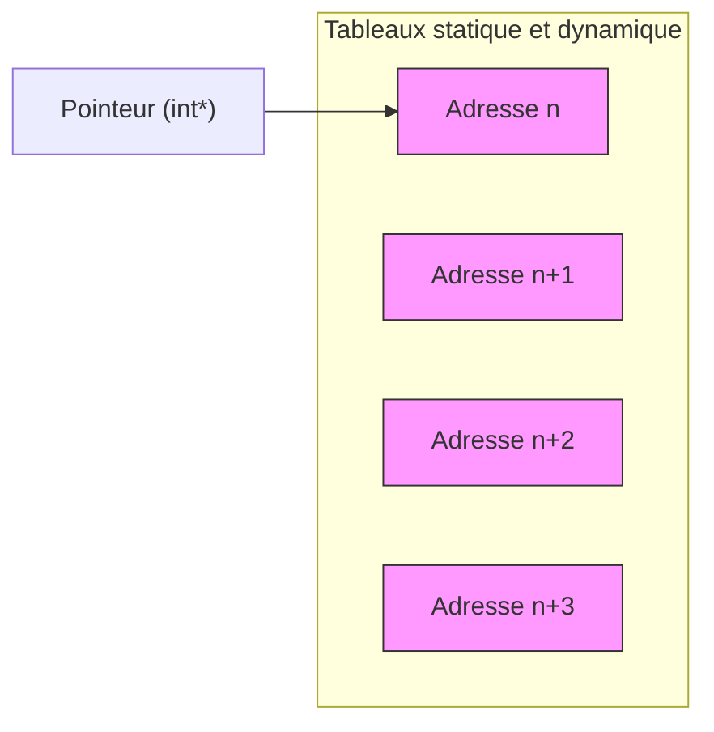

# Manipulations avancées des pointeurs en C

## Pointeurs vers tableaux et chaînes de caractères, incluant tableaux dynamiques

Les pointeurs constituent l'outil fondamental pour manipuler les tableaux et les chaînes de caractères en C, qu'ils soient statiques (alloués au moment de la compilation) ou dynamiques (alloués à l'exécution). Comprendre leur utilisation permet de parcourir, modifier et gérer efficacement ces structures de données.

---

## 1. Pointeurs et tableaux statiques

Un tableau en C est, en réalité, un bloc contigu de mémoire correspondant à plusieurs variables du même type. Le nom d'un tableau représente l'adresse du premier élément. Ainsi, un pointeur peut être utilisé pour accéder aux éléments du tableau.

### Exemple : accès via pointeur à un tableau statique

```c
#include <stdio.h>

int main() {
    int tableau[5] = {10, 20, 30, 40, 50};
    int *ptr = tableau;  // ptr pointe sur le premier élément de tableau

    for (int i = 0; i < 5; i++) {
        printf("tableau[%d] = %d\n", i, *(ptr + i));
    }

    return 0;
}
```

Ici, `ptr` est initialisé avec `tableau`, qui correspond à l'adresse du premier élément. L'opération `*(ptr + i)` permet d'accéder aux éléments successifs du tableau.

---

## 2. Pointeurs et chaînes de caractères

Une chaîne de caractères en C est un tableau de `char` terminé par le caractère nul `'\0'`. Un pointeur vers `char` facilite la manipulation de ces chaînes.

### Exemple : affichage d’une chaîne avec un pointeur

```c
#include <stdio.h>

int main() {
    char str[] = "Bonjour!";
    char *ptr = str;  // ptr pointe sur le premier caractère de str

    while (*ptr != '\0') {
        printf("%c", *ptr);
        ptr++;
    }
    printf("\n");

    return 0;
}
```

L'incrémentation du pointeur `ptr` permet de parcourir la chaîne caractère par caractère.

---

## 3. Tableaux dynamiques et pointeurs

Contrairement aux tableaux statiques, les tableaux dynamiques sont alloués à l’exécution grâce aux fonctions de la bibliothèque standard [`malloc`, `calloc`, `realloc`]. Ces allocations retournent un pointeur vers la zone mémoire allouée.

### Exemple : allocation dynamique d’un tableau

```c
#include <stdio.h>
#include <stdlib.h>

int main() {
    int n = 4;
    int *tabDyn = malloc(n * sizeof(int));  // allocation dynamique

    if (tabDyn == NULL) {
        printf("Échec de l'allocation mémoire\n");
        return 1;
    }

    for (int i = 0; i < n; i++) {
        tabDyn[i] = (i + 1) * 5;
        printf("tabDyn[%d] = %d\n", i, tabDyn[i]);
    }

    free(tabDyn); // libération mémoire

    return 0;
}
```

Dans cet exemple, `tabDyn` pointe vers une zone mémoire pouvant contenir 4 entiers. L'accès aux éléments se fait comme pour un tableau classique, via `tabDyn[i]` ou équivalent pointer.

---

### Diagramme Mermaid : relation pointeur-tableau mémoire



Ce diagramme illustre qu’un pointeur vers un tableau référencie la première adresse du bloc mémoire contigu des éléments du tableau.

---

## Résumé

- Le nom d'un tableau statique est l’adresse de son premier élément ; un pointeur peut donc « marcher » avec le tableau.
- Pour parcourir un tableau ou une chaîne de caractères, on utilise l'arithmétique des pointeurs (`ptr + i`).
- Les tableaux dynamiques sont gérés via des pointeurs après allocation dynamique (`malloc`).
- Libérer la mémoire des tableaux dynamiques avec `free` est indispensable pour éviter les fuites mémoires.

---

## Sources

- [GeeksforGeeks - Pointers and Arrays](https://www.geeksforgeeks.org/pointers-and-arrays-in-c/)
- [TutorialsPoint - C Pointers and Arrays](https://www.tutorialspoint.com/cprogramming/c_pointer_and_array.htm)
- [Programiz - Dynamic Memory Allocation in C](https://www.programiz.com/c-programming/c-dynamic-memory-allocation)
- [cplusplus.com - Pointer to a string](http://www.cplusplus.com/doc/tutorial/ntcs/)
- [Stack Overflow - How do pointers and arrays relate?](https://stackoverflow.com/questions/27907515/how-do-pointers-and-arrays-relate-in-c)

---

Cet article présente l’usage avancé des pointeurs pour manipuler tableaux et chaînes, tant statiques que dynamiques. Maitriser ces concepts ouvre la voie à une gestion mémoire flexible et efficace avec le langage C.