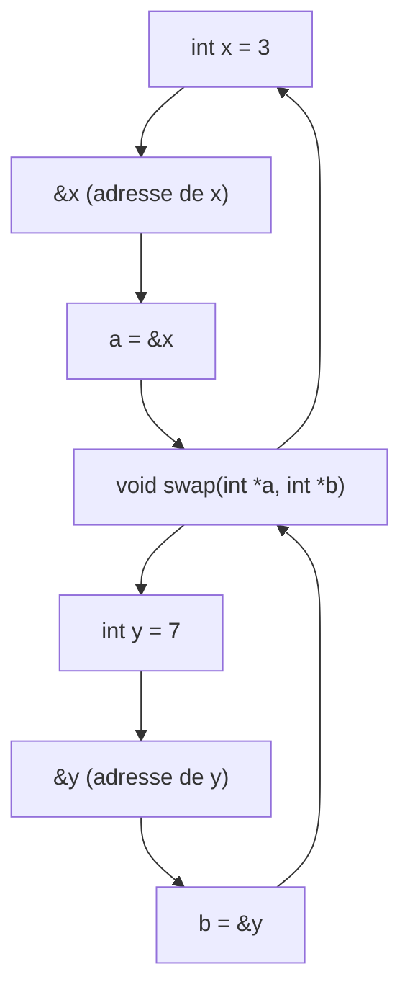

# Manipulation avancée des pointeurs en C

## Utilisation des pointeurs avec fonctions : passage d’arguments par adresse

En C, les arguments passés à une fonction sont, par défaut, transmis par **valeur**, ce qui signifie que la fonction travaille sur une copie des variables appelées. Toute modification affecte uniquement cette copie et n’impacte pas la variable originale.

Passer un argument **par adresse** permet à une fonction de modifier directement la variable passée, en utilisant un pointeur qui référence l’adresse mémoire de cette variable.

---

## Principe du passage par adresse

Au lieu d’envoyer la valeur, on transmet à la fonction **l’adresse** de la variable. La fonction reçoit un pointeur, qu’elle peut déréférencer pour lire ou modifier la valeur originale.

### Syntaxe simplifiée

```c
void f(int *p) {
    *p = 10;   // modifie la valeur pointée par p
}

int main() {
    int x = 5;
    f(&x);    // passe l'adresse de x
    // x vaut maintenant 10
}
```

Ici, `f` reçoit un `int*` (pointeur vers int), modifie la valeur pointée. L’appel dans `main` utilise l’opérateur `&` pour passer l’adresse de `x`.

---

## Avantages du passage par adresse

- **Modification directe** de variables originales.
- **Économie de mémoire et de temps** en ne copiant pas de grandes structures.
- **Permet le retour de plusieurs valeurs** via des pointeurs, alors que la fonction ne peut retourner qu’une seule valeur.

---

## Exemple complet : échange de deux variables (swap)

```c
#include <stdio.h>

void swap(int *a, int *b) {
    int temp = *a;
    *a = *b;
    *b = temp;
}

int main() {
    int x = 3, y = 7;
    printf("Avant swap : x = %d, y = %d\n", x, y);
    swap(&x, &y);
    printf("Après swap : x = %d, y = %d\n", x, y);
    return 0;
}
```

Dans cet exemple, la fonction `swap` reçoit les adresses de `x` et `y` et échange leurs valeurs en travaillant directement sur la mémoire.

---

### Diagramme Mermaid : passage d’arguments par adresse



Le diagramme illustre comment les adresses des variables `x` et `y` dans `main` sont passées à la fonction `swap` et utilisées via les pointeurs `a` et `b`.

---

## Passer des structures ou tableaux par adresse

Pour transmettre des structures volumineuses ou des tableaux à des fonctions, on passe généralement leur adresse (ou un pointeur) pour éviter des copies coûteuses.

```c
struct Point {
    int x, y;
};

void translate(struct Point *p, int dx, int dy) {
    p->x += dx;
    p->y += dy;
}

int main() {
    struct Point pt = {1, 2};
    translate(&pt, 3, 4);
    printf("Point après translation : (%d, %d)\n", pt.x, pt.y);
    return 0;
}
```

---

## Erreurs fréquentes à éviter

- **Ne pas passer l'adresse** : passer la valeur au lieu de l’adresse ne permet pas de modifier la variable originale.
- **Déréférencement de pointeur non initialisé** : utiliser un pointeur sans l'initialiser (avec une adresse valide) provoque un comportement indéfini.
- **Mauvais type** : le type du pointeur doit être compatible avec la variable pointée.

---

## Sources

- [GeeksforGeeks - Passing Arguments in C](https://www.geeksforgeeks.org/passing-arguments-to-functions-in-c/)
- [TutorialsPoint - Pass by Reference](https://www.tutorialspoint.com/cprogramming/c_pass_by_reference.htm)
- [Programiz - Pointers in C Programming](https://www.programiz.com/c-programming/c-pointers)
- [Microsoft Docs - Pointers](https://learn.microsoft.com/en-us/cpp/c-language/pointers)
- [Stack Overflow - Pass by reference in C](https://stackoverflow.com/questions/3042038/passing-by-reference-in-c)

---

La technique du passage d’arguments par adresse grâce aux pointeurs permet de manipuler directement les variables originales dans une fonction, offrant un puissant levier pour écrire du code performant et modulaire en C.