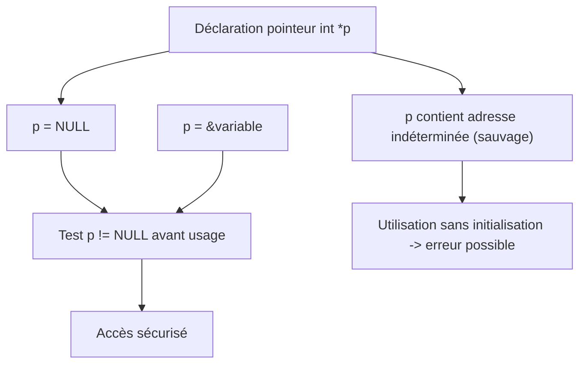

# Erreurs courantes liées aux pointeurs en C

## Pointeurs non initialisés (pointeurs sauvages)

Un pointeur non initialisé, communément appelé **pointeur sauvage**, est un pointeur qui ne contient pas d'adresse valide avant son utilisation. Utiliser un tel pointeur peut entraîner des comportements imprévisibles, des plantages, ou des corruptions mémoire.

---

## Pourquoi un pointeur devient-il sauvage ?

Lorsqu’une variable pointeur est déclarée, sa valeur contenue est indéfinie (résidu mémoire) jusqu’à ce qu’on lui attribue explicitement une adresse valide. Exemple :

```c
int *ptr;  // ptr est non initialisé, contient une adresse indéterminée
```

Accéder à `*ptr` ici est dangereux car la mémoire référencée peut être:

- Non allouée,
- Réservée à un autre processus,
- Protégée,
- Ou contenir des données aléatoires.

---

## Exemple de pointeur sauvage et conséquences

```c
#include <stdio.h>

int main() {
    int *p;          // pointeur non initialisé
    *p = 10;         // tentative d’accès à une adresse inconnue -> comportement indéfini
    printf("%d\n", *p);
    return 0;
}
```

Ce code est susceptible de provoquer une erreur de segmentation (segfault) car `p` pointe vers une zone mémoire indéterminée.

---

## Comment éviter et corriger un pointeur sauvage ?

### 1. Initialiser les pointeurs à `NULL` ou à une adresse valide lors de la déclaration

```c
int *p = NULL;
```

Un pointeur NULL est garanti ne pointer vers aucune zone mémoire valide, ce qui permet d’effectuer des tests avant d’utiliser le pointeur.

### 2. Affecter une adresse valide avant utilisation

```c
int var = 5;
int *p = &var;
```

### 3. Vérifier la validité avant d’accéder

```c
if (p != NULL) {
    printf("%d\n", *p);
} else {
    // traitement en cas de pointeur invalide
}
```

---

## Diagramme Mermaid : cycle de vie d’un pointeur sain vs pointeur sauvage



---

## Synthèse des bonnes pratiques

| Risque                         | Solution                                     |
|--------------------------------|----------------------------------------------|
| Pointeur non initialisé        | Initialiser à NULL ou une adresse valide     |
| Utilisation d’une zone invalide | Toujours vérifier la validité du pointeur    |
| Accès à mémoire libérée        | Mettre le pointeur à NULL après `free()`    |

---

## Sources

- [GeeksforGeeks - Wild Pointers in C](https://www.geeksforgeeks.org/wild-pointers-c-causes-prevention/)
- [TutorialsPoint - Pointers in C](https://www.tutorialspoint.com/cprogramming/c_pointers.htm)
- [Programiz - Pointers in C](https://www.programiz.com/c-programming/c-pointers)
- [Microsoft Docs - Pointers in C](https://learn.microsoft.com/en-us/cpp/c-language/pointers)
- [Stack Overflow - How to avoid wild pointers in C?](https://stackoverflow.com/questions/2058649/how-to-avoid-wild-pointers-in-c)

---

En résumé, un pointeur sauvage est une cause fréquente de bugs et de failles de sécurité. Sa prévention passe par une initialisation systématique, une affectation avant utilisation, et des tests explicites avant toute manipulation mémoire.