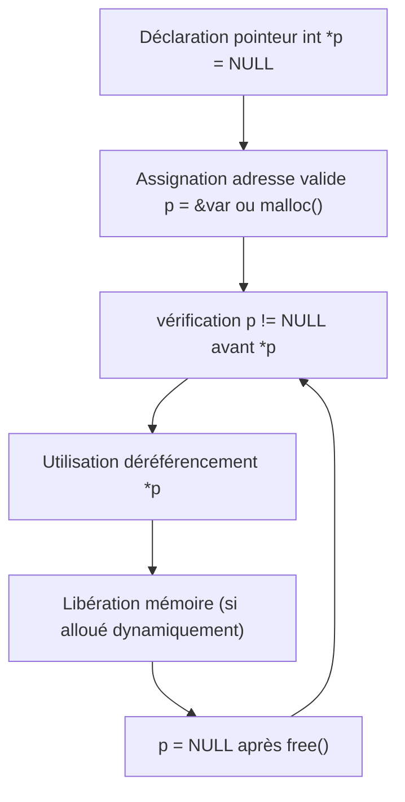

# Erreurs courantes liées aux pointeurs en C

## Déréférencement de pointeurs nuls ou invalides

Le déréférencement d’un pointeur consiste à accéder à la donnée située à l’adresse mémoire contenue dans ce pointeur. Si ce dernier est **nul** (`NULL`) ou pointe vers une adresse non valide, l’opération mène à un comportement indéfini, souvent une **erreur de segmentation** (segfault) provoquant l’arrêt brutal du programme.

---

## Qu’est-ce qu’un pointeur nul ou invalide ?

- **Pointeur NULL** : pointeur explicitement initialisé à `NULL`, signifiant qu’il ne pointe vers aucune adresse mémoire valide.
- **Pointeur invalide** : pointeur qui contient une adresse mémoire erronée (non allouée, déjà libérée, ou non initialisée).

---

## Pourquoi le déréférencement de tels pointeurs est dangereux ?

Accéder à une adresse invalide conduit à :

- Violation de la mémoire protégée,
- Corruption des données,
- Plantage immédiat sous forme d’erreur (segfault),
- Comportement imprévisible difficile à déboguer.

---

## Exemples

### Exemple 1 : Déréférencement d’un pointeur NULL

```c
#include <stdio.h>

int main() {
    int *p = NULL;
    printf("%d\n", *p);  // tentative d’accès à une adresse NULL -> plantage probable
    return 0;
}
```

### Exemple 2 : Déréférencement d’un pointeur invalide (non initialisé)

```c
#include <stdio.h>

int main() {
    int *p;    // non initialisé (sauvage)
    printf("%d\n", *p);  // accès à une adresse indéterminée -> comportement indéfini
    return 0;
}
```

### Exemple 3 : Déréférencement après libération mémoire

```c
#include <stdlib.h>
#include <stdio.h>

int main() {
    int *p = malloc(sizeof(int));
    *p = 10;
    free(p);
    printf("%d\n", *p);  // accès à une zone mémoire libérée -> comportement indéfini
    return 0;
}
```

---

## Prévenir ces erreurs

### 1. Initialiser les pointeurs à `NULL` lors de la déclaration

```c
int *p = NULL;
```

### 2. Vérifier que le pointeur n’est pas NULL avant d’accéder

```c
if (p != NULL) {
    printf("%d\n", *p);
} else {
    // gérer le cas du pointeur nul
}
```

### 3. Après `free`, assigner NULL au pointeur

```c
free(p);
p = NULL;
```

Cela évite d’utiliser à tort un pointeur devenant un **pointeur pendulaire** (dangling pointer).

---

## Diagramme Mermaid : cycle de vie sain d’un pointeur



---

## Résumé

| Situation                            | Conséquence                         | Solution                          |
|------------------------------------|-----------------------------------|----------------------------------|
| Déréférencement de `NULL`           | Plantage immédiat (segfault)       | Tester le pointeur avant usage    |
| Déréférencement pointeur non initialisé | Comportement indéfini             | Initialiser pointeur à NULL       |
| Déréférencement pointeur après `free` | Comportement indéfini ou plantage | Mettre le pointeur à NULL après `free` |

---

## Sources

- [GeeksforGeeks - Null Pointer Dereference in C](https://www.geeksforgeeks.org/null-pointer-dereference-in-c-cpp/)
- [TutorialsPoint - C Null Pointer](https://www.tutorialspoint.com/cprogramming/c_pointers.htm)
- [Programiz - Pointer Invalid Access](https://www.programiz.com/c-programming/c-pointers)
- [Microsoft Documentation - Pointer Safety](https://learn.microsoft.com/en-us/cpp/c-language/pointers)

---

Déréférencer un pointeur nul ou invalide est une source classique d’erreur en C. La vigilance sur l’initialisation, la validation préalable et la gestion post-libération sont les clés pour garantir la robustesse des programmes.