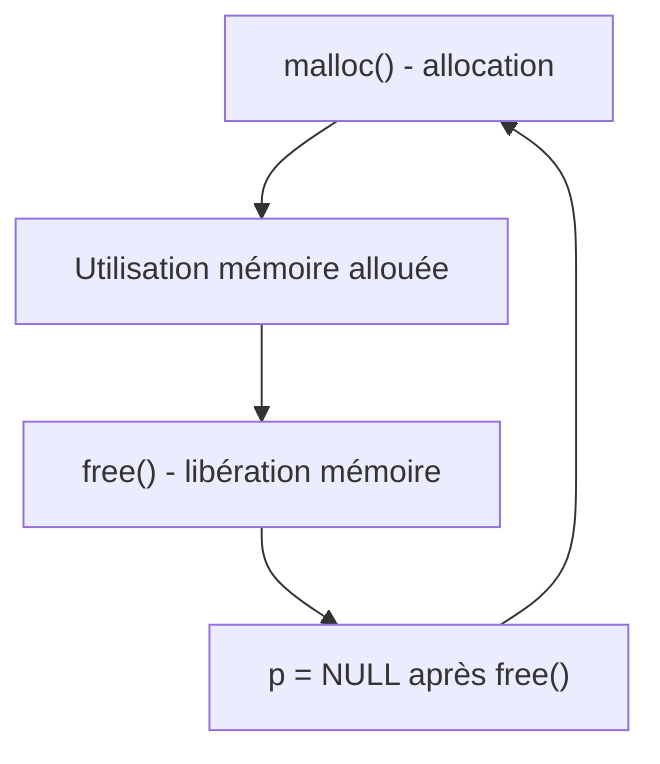

# Erreurs courantes liées aux pointeurs en C

## Fuites mémoire et corruption

La gestion dynamique de la mémoire en C repose sur l’utilisation de pointeurs avec les fonctions d’allocation (`malloc`, `calloc`, `realloc`) et de libération (`free`). Une mauvaise manipulation entraîne deux catégories majeures d’erreurs : les **fuites mémoire** et la **corruption mémoire**. Ces erreurs provoquent des dysfonctionnements, une dégradation des performances, voire des plantages.

---

## 1. Fuites mémoire

### Qu’est-ce qu’une fuite mémoire ?

Une fuite mémoire survient lorsque la mémoire allouée dynamiquement n’est **pas libérée**, ou que la référence à cette mémoire est perdue à cause d’un pointeur écrasé, empêchant l’accès et la libération ultérieure.

### Conséquences

- Croissance continue de la mémoire utilisée par le programme,
- Ralentissement puis éventuel plantage du programme,
- Problèmes particulièrement critiques dans les applications de longue durée (serveurs, systèmes embarqués).

---

### Exemple simple de fuite mémoire

```c
#include <stdlib.h>

void f() {
    int *p = malloc(sizeof(int) * 10);
    if (p == NULL) return;
    // utilisation de p ici
    // oubli de free(p) -> fuite mémoire
}

int main() {
    for (int i = 0; i < 1000; i++) {
        f();  // chaque appel alloue sans libérer
    }
    return 0;
}
```

---

## 2. Corruption mémoire

### Qu’est-ce que la corruption mémoire ?

La corruption mémoire se produit lorsque le programme écrit **en dehors des limites** de la mémoire allouée (buffer overflow), ou utilise une zone mémoire déjà libérée (use-after-free), ce qui modifie de manière imprévue d’autres données en mémoire.

### Conséquences

- Comportement erratique ou imprévisible,
- Difficulté de détection et de diagnostic,
- Risques de failles de sécurité.

---

### Exemples de corruption mémoire

#### Buffer overflow

```c
#include <stdio.h>
#include <stdlib.h>
#include <string.h>

int main() {
    char *buf = malloc(10);
    strcpy(buf, "Cette chaine est trop longue pour buf");
    printf("%s\n", buf);
    free(buf);
    return 0;
}
```

Ici, la copie dépasse la taille allouée (10 octets), modifiant des zones mémoire adjacentes.

#### Use-after-free

```c
#include <stdio.h>
#include <stdlib.h>

int main() {
    int *p = malloc(sizeof(int));
    *p = 42;
    free(p);
    printf("%d\n", *p);  // utilisation après libération -> comportement indéfini
    return 0;
}
```

---

## Bonnes pratiques pour éviter fuites et corruption

| Problème                | Solution                                                 |
|------------------------|----------------------------------------------------------|
| Oubli de `free`         | Toujours libérer la mémoire allouée avec `free()`       |
| Perte de référence       | Ne pas écraser un pointeur avant d’avoir libéré la mémoire |
| Utilisation après `free` | Mettre le pointeur à `NULL` après `free()`               |
| Dépassement de buffer    | Vérifier la taille des données copiées ou écrites        |

---

## Diagramme Mermaid : cycle mémoire et bons gestes



---

## Outils de détection

- **Valgrind** (Linux) : outil d’analyse dynamique détectant fuites, accès invalides.
- **AddressSanitizer (ASan)** : intégré à GCC/Clang pour détecter erreurs mémoire.
- **Static analyzers** : outils qui examinent le code sans l’exécuter.

---

## Sources

- [GeeksforGeeks - Memory leaks and corruption in C](https://www.geeksforgeeks.org/memory-leaks-and-memory-corruption-in-c/)
- [TutorialsPoint - Dynamic Memory Allocation in C](https://www.tutorialspoint.com/cprogramming/c_dynamic_memory_allocation.htm)
- [Valgrind Documentation](http://valgrind.org/docs/manual/mc-manual.html)
- [GNU AddressSanitizer](https://clang.llvm.org/docs/AddressSanitizer.html)
- [Microsoft Docs - Detecting Memory Issues with Static Analysis](https://learn.microsoft.com/en-us/visualstudio/code-quality/using-static-analysis-to-find-memory-leaks)

---

Garder un contrôle strict sur l’allocation et la libération mémoire, réaliser systématiquement des vérifications, et utiliser des outils dédiés sont la clé pour éviter les fuites et la corruption mémoire, assurant ainsi la stabilité et la sécurité des programmes en C.